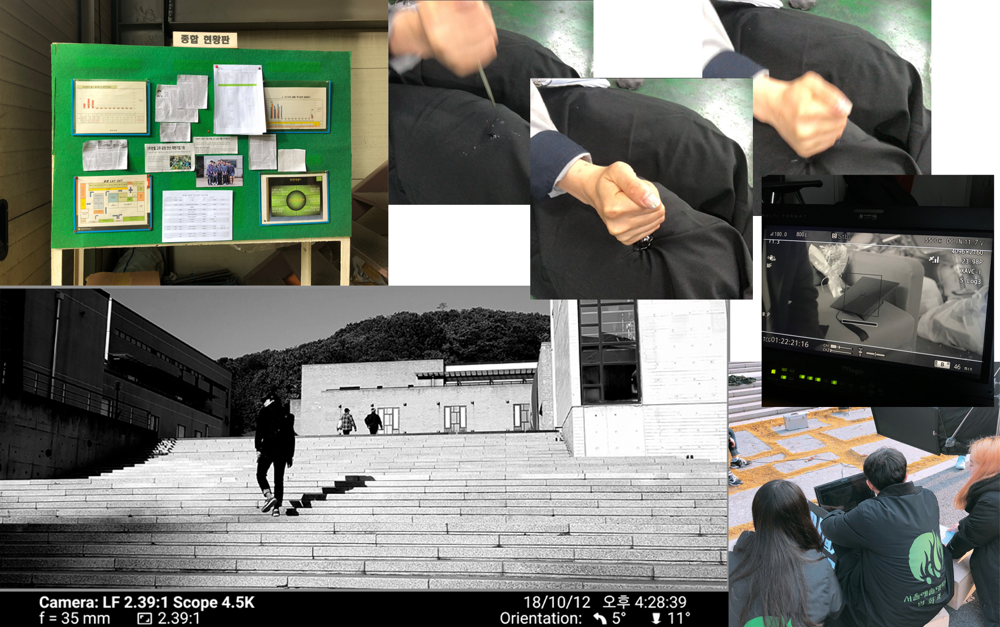
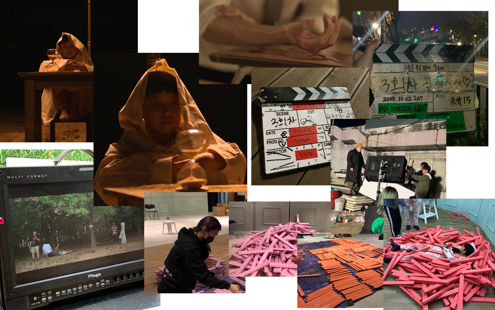
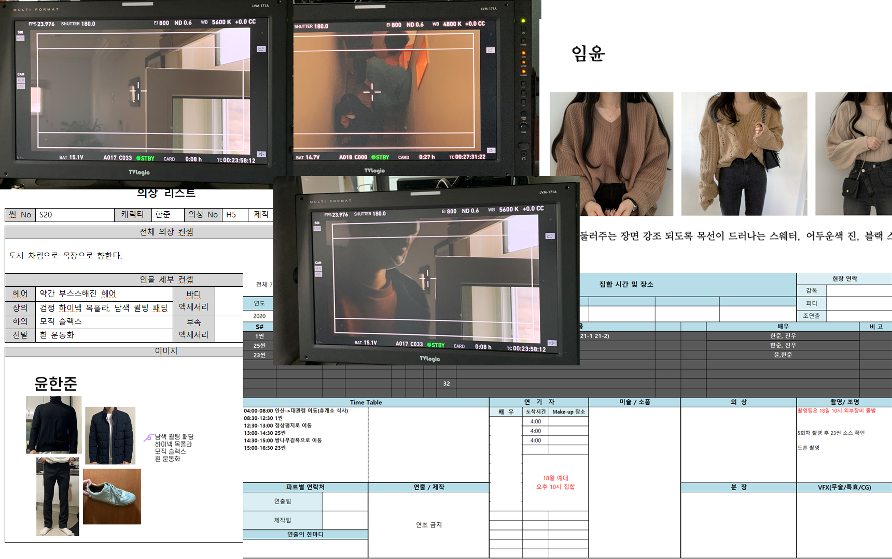

# SELF INTRODUCTION

## ❤️ 인적사항
##### 이름: 김단유
##### 소속: 정보과학대학
##### 학년: 2학년 *(2022년 기준)*

---

## 🧡 경력사항
### 2018

> * 단편영화 미술팀, 조감독 및 미술감독

### 2019

> * 단편영화 미술팀, 연출팀, 미술감독, PD

### 2021

> * 단편영화 미술감독 및 조감독

> 
> * 기말 프로젝트 디자인 총괄      
>  * [시안 과정](https://github.com/DU-KIM/KimDanyu/blob/main/%EC%8B%9C%EC%95%88v0529.001(edit)/%EC%8B%9C%EC%95%88v0529.001(edit).md)    
>  * [최종본](https://github.com/DU-KIM/KimDanyu/blob/main/%EC%9D%98%EA%B3%BC%ED%95%99%EC%9D%B4%EB%85%B8%EB%B2%A0%EC%9D%B4%EC%85%98%EA%B8%B0%EB%A7%90%EB%B0%9C%ED%91%9C_design/%EC%9D%98%EA%B3%BC%ED%95%99%EC%9D%B4%EB%85%B8%EB%B2%A0%EC%9D%B4%EC%85%98%EA%B8%B0%EB%A7%90%EB%B0%9C%ED%91%9C_design.md)    

---

## 💛 사용 가능 프로그램 및 언어
> * Davinvi Resolve (영상 편집)   
> * Premiere Pro (영상 편집)   
> * Photoshop   
> * SPSS   
> * Excel   
> * Python   
> * C   

---

## 💚 전공 수강 과목
### 2021
| 1학기 | 2학기|
|:---:|:---:|
|데이터분석과시각화|인공지능융합개론|
|의과학이노베이션|선형대수|

### 2022
|1학기|
|:---:|
|의료데이터베이스|
|통계분석과머신러닝|
|C프로그래밍|
|소프트웨어세미나I|

---

## 💙 2022 - 2학기 계획
> * 과 학술동아리 가입 후 스터디 진행
>> * 스스로 부족함을 느껴 조금 더 공부해보고자 합니다.
> * 토익 800점 이상 취득
>> * 예전 점수로의 회복을 시도해보려고 합니다.
