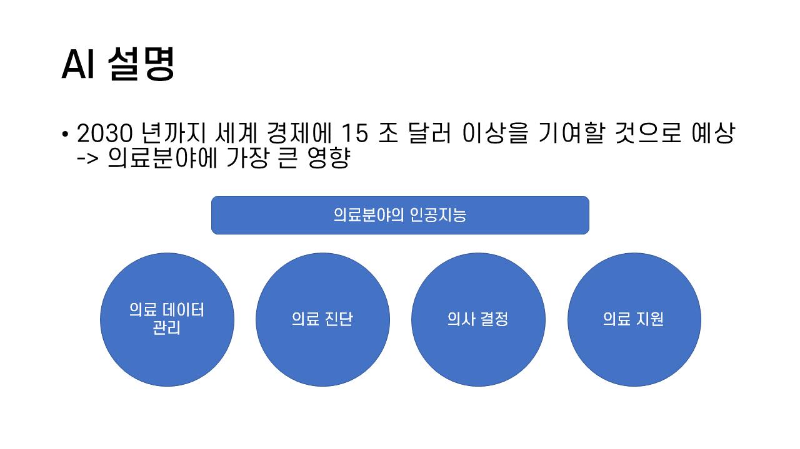
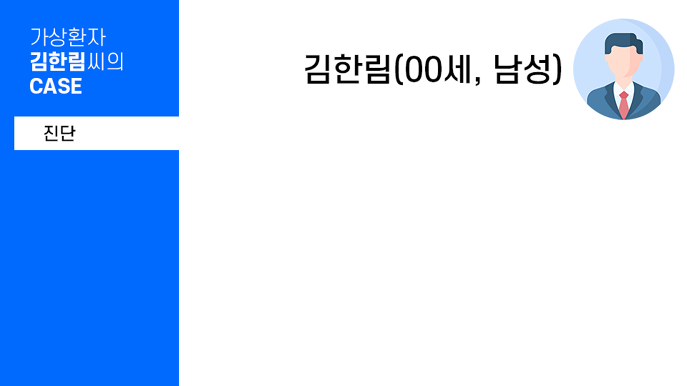
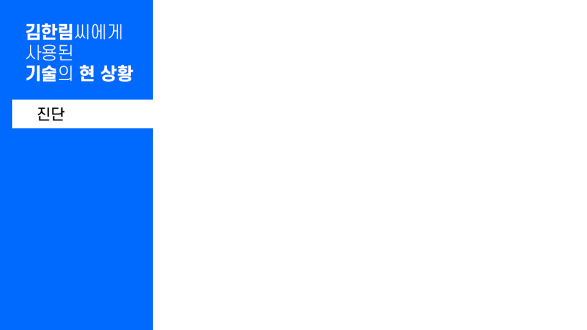

# PPT 시안 작업 (2021-1)

의과학 이노베이션 기말 팀 프로젝트의 디자인을 담당하였다.   

* * *
### 제목 슬라이드

> 가독성이 좋으면서 날카롭지 않은 폰트 '에스코어 드림'을 사용하였다.

### 목차 슬라이드

> 집중도, 가독성 각자 다른 중점을 가진 목차 시안을 가지고 논의하여 2안으로 최종 결정하였다.

### 내용 슬라이드

> 정보가 많이 들어갈 슬라이드의 경우 어떻게 하는 것이 좋을지 시안을 가져갔고, 이 시안은 최종 버전에서 텍스트를 최대한 줄이는 방향으로 변경되었다.
 
### 가상환자 슬라이드

> 우리 팀 발표의 특장점은 상용화 초기 단계에 있는 기술들과, 미래에 상용화 가능성이 있는 기술들을 가상 환자 프로파일에 적용시킨 시나리오로 발표하는 것이었다.
> 따라서 케이스를 발표하고 미래 기술을 어떻게 적용하는지 보여준 후,

> 현재 기술은 어디까지 왔는지를 보여주는 형식으로 가상환자 부분을 마무리 하는 형식을 디자인으로 표현했다.
