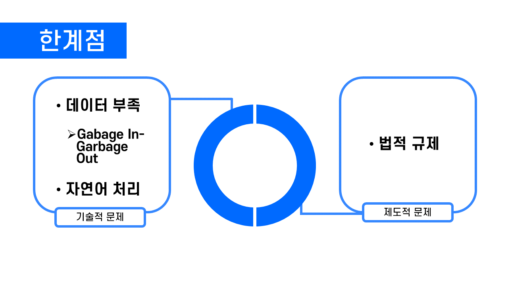

# 의과학 이노베이션 최종본
편집된 내용이 있으며, 이 페이지상 슬라이드의 순서와 발표 당시 슬라이드의 순서는 같지 않습니다.
***

### 제목슬라이드
> 
> * 줌 발표였기 때문에, 시작할 때 이목을 집중시키기 위해 컬러 비중이 높은 슬라이드 디자인을 채택했다.

### 목차슬라이드
> 
> * 시안 중 두 번째를 채택했다.

### 내용 슬라이드
> 
> 
> * 핵심 키워드를 슬라이드에 포함하고 발표 내용을 통해 설명하는 방식으로 바꾸고
> 
> 도식화 하는 등 슬라이드를 보는 것을 '읽기'로 인식하지 않도록 주의했다.
> 
> * 최대한 아이콘을 활용하였다.

